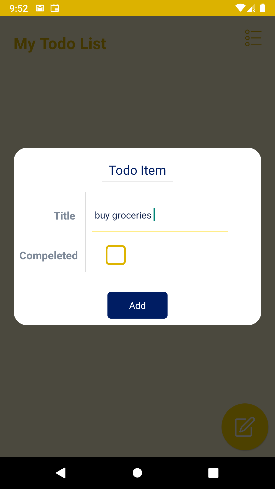
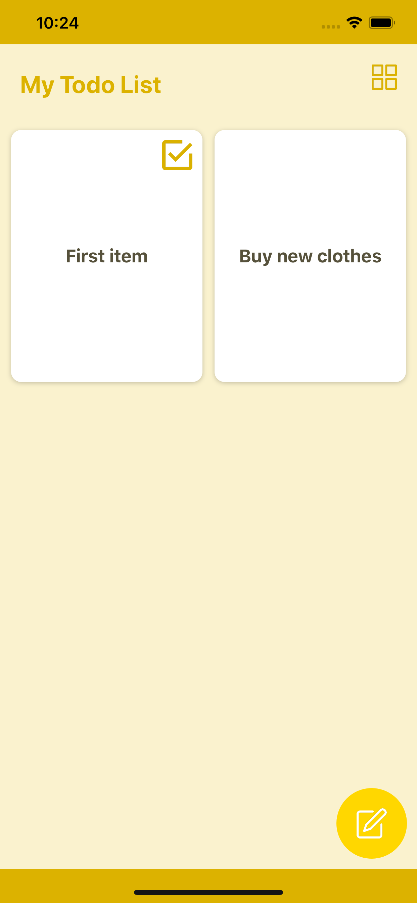
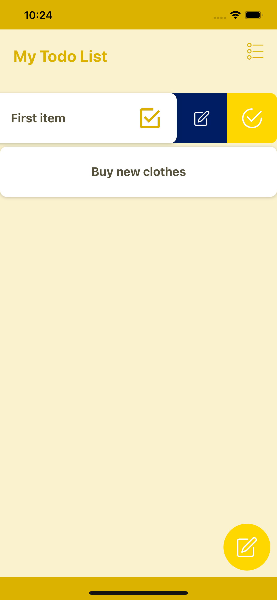
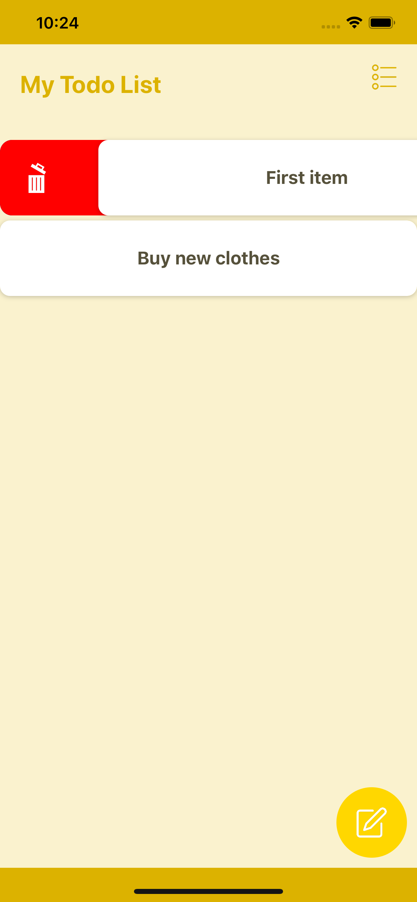

# TodoApp
Simple yet beautiful todo app the works on both android and ios

steps to run the project

1- open a terminal in the root of the project.

2- type "yarn" to install node_modules, if you don't have it please install it first, it's a light weight package manager.
     Here's a link: https://classic.yarnpkg.com/en/docs/install/
     
3- after installation, go to android/local.properties file and change sdk.dir value to be your android sdk location.

4- now while in root of project again in the terminal type "cd ios && pod install"

That's it you can now run the project on android and iOS using the following commands:

-android: "npx react-native run-android"

-iOS: "npx react-native run-ios". (in case you have a mac)

I attached some screenshots for each platform.
If you're having any problems running the app or have any questions please feel free to contact me anytime.

